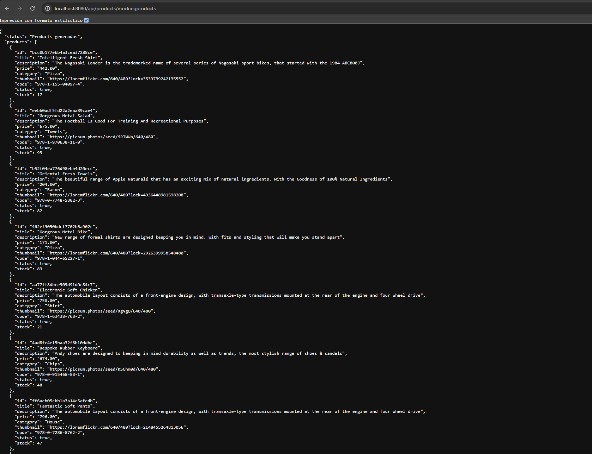

# Mocking_manejo_errores

## Se trabajo con Persistencia en memoria

>Consigna
>✓ Se aplicará un módulo de mocking y un manejador de errores a tu servidor actual

### Aspectos a incluir

>✓ Generar un módulo de Mocking para el servidor, con el fin de que, al inicializarse 
>pueda generar y entregar 100 productos con el mismo formato que entregaría una 
>petición de Mongo. Ésto solo debe ocurrir en un endpoint determinado (‘/mockingproducts’)

>✓ Además, generar un customizador de errores y crear un diccionario para tus errores más comunes al crear un 
>producto, agregarlo al carrito, etc.

>Si paso los datos correctamente me genera el producto en memoria:

>Si le paso uno de los campos con un tipo de dato erroneo:

>Salida de Consola: donde se indica que el code tiene que ser una string no un number.

> Si no le paso un elemento como el code:

Salida de Consola: donde se indica que el code deberia recibir un dato string pero recibio un dato "UNDEFINED".

